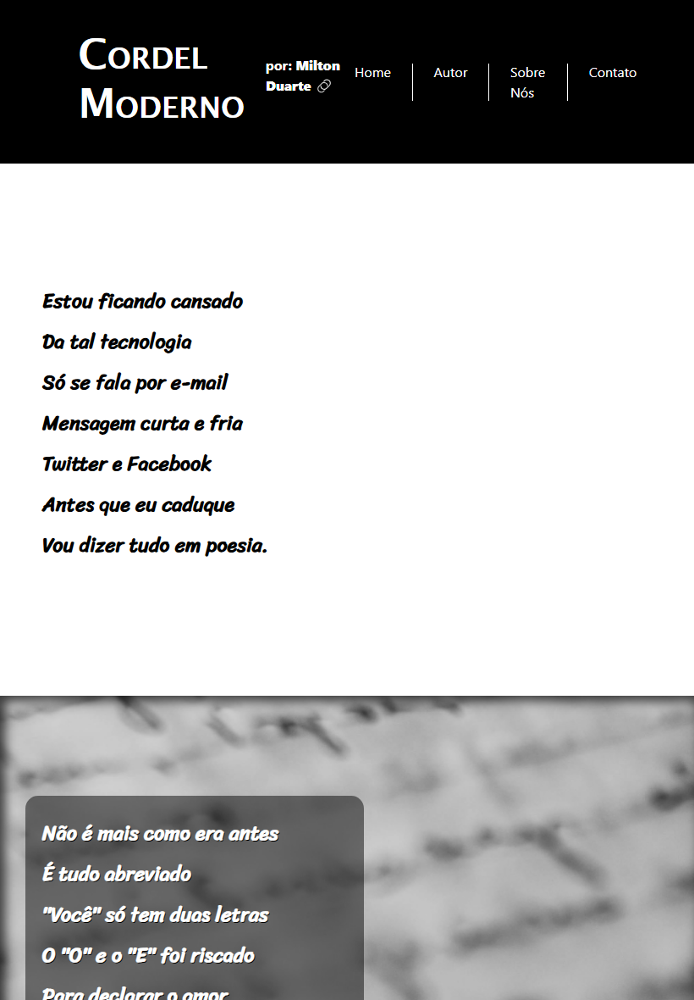

# 🎤 Cordel Moderno: Um Poema Digital

Um cordel sobre a Tecnologia de hoje - por **Milton Duarte.**

Bem-vindo ao mundo do cordel moderno!

Este repositório te convida a mergulhar em um poema digital que celebra a evolução da tecnologia e a nostalgia da comunicação antiga. Através de um cordel emocionante, escrito por **Milton Duarte**, você vai reviver a magia das cartas e se conectar com a velocidade da internet.

## O que te espera neste repositório:

*   **Um cordel digital:** Explore "Cordel Moderno", um poema que brinca com as diferenças entre a comunicação tradicional e a digital, usando versos em septilhas (estrofes de sete versos).

*   **Design elegante:** O site foi construído com Bootstrap 4 para garantir um layout responsivo, adaptando-se perfeitamente a qualquer tela.

*   **Estética visual:** Aproveite a beleza do cordel com elementos visuais cuidadosamente selecionados, utilizando Font Awesome para ícones e Devicon para representar as tecnologias.

*   **Código claro e organizado:** Explore o código HTML, CSS e o arquivo `css/estilo.css` com os estilos personalizados que tornam o site único.

## Explore o cordel:

*   **Acesse o poema completo:** [https://www.recantodasletras.com.br/poesias/3186743](https://www.recantodasletras.com.br/poesias/3186743)

## Demonstração

## Compartilhe sua experiência:

*   **Deixe um feedback:** Gostou do cordel? Tem sugestões? Compartilhe suas ideias abrindo uma [issue](https://github.com/Domisnnet/cordel-moderno/issues) neste repositório.
*   **Contribua com o projeto:** Quer ajudar a melhorar o site? Faça um [pull request](https://github.com/Domisnnet/cordel-moderno/pulls) com suas alterações.

Vamos juntos celebrar a beleza da poesia e a evolução da comunicação!

## Recursos:

*   **Bootstrap 4:** [https://getbootstrap.com/](https://getbootstrap.com/)
*   **Font Awesome:** [https://fontawesome.com/](https://fontawesome.com/)
*   **Devicon:** [https://devicon.dev/](https://devicon.dev/)

## Próximos passos:

*   Implementar uma página de contato para o autor.
*   Criar um layout mais dinâmico com recursos JavaScript.
*   Adicionar mais conteúdo ao cordel.

Aproveite a leitura!

## Tecnologias Utilizadas

Este projeto foi desenvolvido com:

- HTML5
- CSS3
- Bootstrap 4
- Font Awesome
- [Devicons](https://devicons.dev/)

Aqui estão algumas badges representando as tecnologias:

    
    
    
    

## Licença

Este projeto está sob a licença MIT - veja o arquivo [LICENSE](LICENSE) para detalhes.

## Contato

Para dúvidas ou sugestões, entre em contato via:

